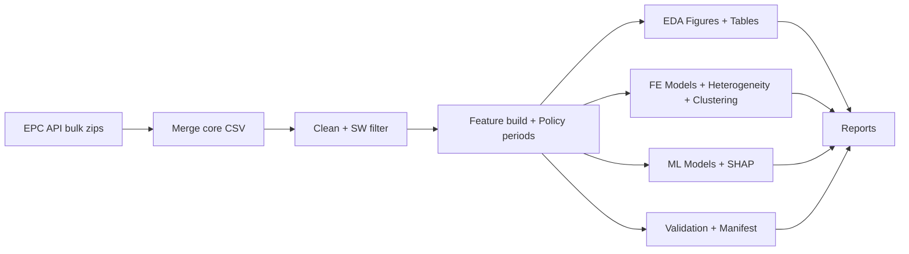

## EW Housing Energy Impact

Portfolio-grade, reproducible analysis of UK EPC data (South West England, 2008–2025).
This repo turns the dissertation into a **clean pipeline** with validation, reproducibility,
and fully scripted outputs.

**Highlights**
- End-to-end CLI (`ewhei run-all`)
- Fixed-effects + heterogeneity + clustering
- Predictive modelling with explainability (SHAP + feature importance)
- Data validation + manifest/provenance artifacts
- Tests for core logic

**Architecture **


### Project Layout
- `scripts/pipeline/epc_download_merge_fast.py`  
  Downloads and merges EPC bulk data into `data/processed/ew_epc_core.csv`.
- `scripts/pipeline/clean_epc.py`  
  Cleans and filters to South West local authorities.
- `scripts/pipeline/build_features.py`  
  Imputes missingness, adds policy periods, saves modelling-ready data.
- `scripts/pipeline/report_eda.py`  
  Generates EDA figures and summary tables.
- `scripts/pipeline/run_did.py`  
  Fixed-effects models, heterogeneity analysis, clustering outputs.
- `scripts/pipeline/train_models.py`  
  Predictive modelling (regression + classification, SHAP/feature importances).
- `scripts/pipeline/quality_report.py`  
  Data quality HTML report (missingness + drift proxy).
- `scripts/pipeline/run_report.py`  
  Runs the full pipeline end-to-end.

### CLI (recommended)
Install dependencies and the local package:

```bash
pip install -r requirements.txt
pip install -e .
```

Run the full pipeline:
```bash
ewhei run-all
```

Validate data:
```bash
ewhei validate
```

Write data manifest:
```bash
ewhei manifest
```

Generate data quality dashboard:
```bash
ewhei quality
```

### Data Access
Add EPC API credentials to `.env`:

```
EPC_EMAIL=you@example.com
EPC_API_KEY=your_key_here
```

### Outputs
- Processed data: `data/processed/`
- Figures: `reports/figures/`
- Tables: `reports/tables/`
- Artifacts: `reports/artifacts/` (validation report + data manifest)
- Model cards: `reports/model_cards/`

### Tests
```bash
pytest
```

### Documentation
- Data dictionary: `docs/data_dictionary.md`

### Streamlit Demo (Deployment Layer)
```bash
streamlit run app.py
```

### FastAPI (Lightweight API)
```bash
uvicorn api:app --reload --port 8000
```

### Streamlit Docker
```bash
docker build -f Dockerfile.streamlit -t ewhei-streamlit .
docker run -p 8501:8501 ewhei-streamlit
```

### FastAPI Docker
```bash
docker build -f Dockerfile.api -t ewhei-api .
docker run -p 8000:8000 \
  -v $(pwd)/data/processed:/app/data/processed \
  -v $(pwd)/reports/artifacts:/app/reports/artifacts \
  ewhei-api
```

### CI
GitHub Actions workflow is defined in `.github/workflows/ci.yml`.
